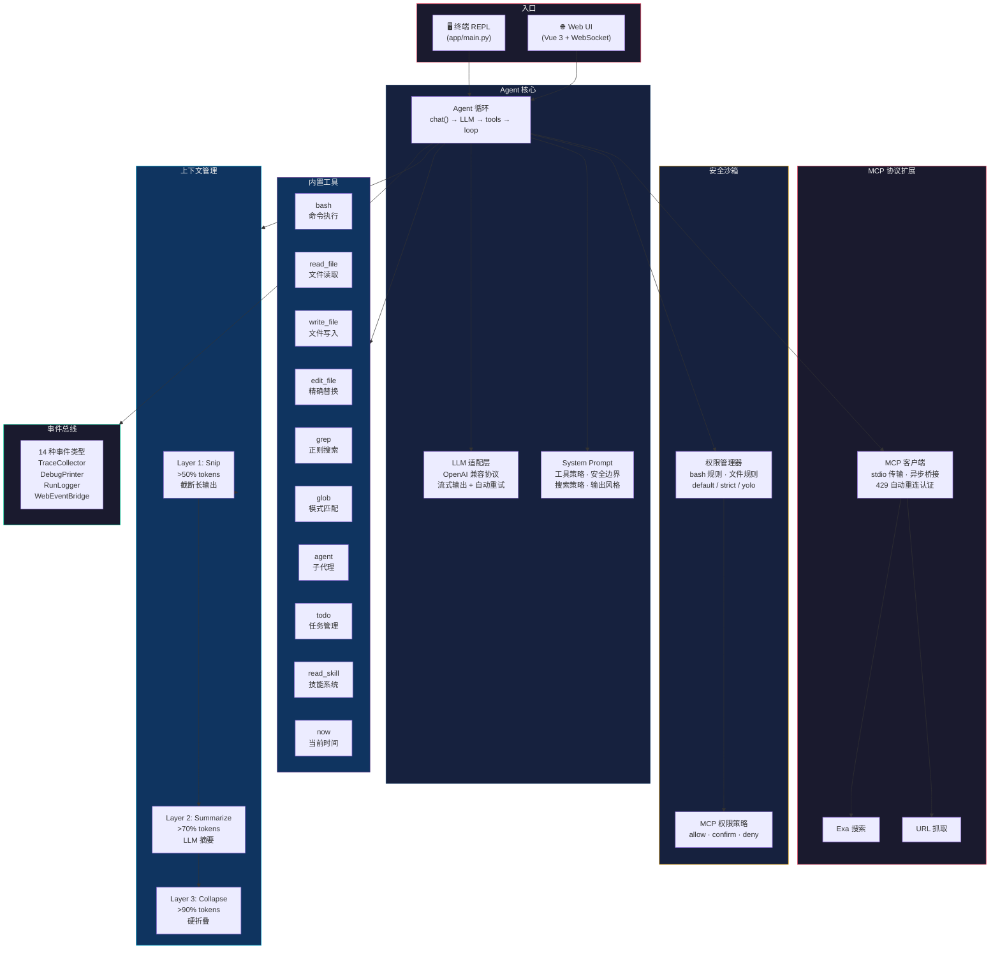

# my-corecoder

**从零构建的安全优先 AI 编程助手** — 支持终端（TUI）和 Web 两种交互模式，在终端中帮你写代码、搜代码、改 bug、跑命令的 AI Agent。



## 功能亮点

### 安全沙箱
- **三种权限模式**：`default`（智能判断）/ `strict`（从严拒绝）/ `yolo`（全部放行）
- **Bash 安全**：20+ 条正则规则检测危险命令（`rm -rf /`、`mkfs`、fork 炸弹、`curl | bash` 等）
- **文件安全**：阻止写入系统路径、SSH 密钥读取、`.env` 泄露，敏感文件操作需二次确认
- **MCP 策略**：外部工具粒度的 allow / confirm / deny 控制

### 三层上下文压缩
| 层级 | 触发阈值 | 策略 | 安全机制 |
|------|---------|------|---------|
| Layer 1: Snip | >50% (64K tokens) | 截断过长工具输出，保留首尾 3 行 | 豁免 read_file 结果（核心证据不丢失） |
| Layer 2: Summarize | >70% (89.6K tokens) | 用 LLM 压缩旧对话轮次为摘要 | 压缩比 <10% 则回滚 |
| Layer 3: Hard collapse | >90% (115.2K tokens) | 全量摘要，仅保留最近 4 条消息 | 同上回滚保护 |

### MCP 协议集成
- 支持通过 stdio 子进程接入外部 MCP 工具服务器
- 异步事件循环运行在后台守护线程，对同步 Agent 循环透明
- 429 限流自动重连认证（携带 API key 重建连接后重试）

### 事件驱动架构
14 种事件类型贯穿 Agent 生命周期，4 个消费者并行订阅：追踪收集、调试输出、运行日志（JSONL）、Web 事件桥接。

### Web 前端
基于 Vue 3 + Naive UI 的实时聊天界面：
- WebSocket 流式传输（token 级别延迟渲染）
- 工具调用卡片（展开查看参数和结果 diff）
- 权限弹窗（Allow / Deny / Allow Directory）
- 侧边栏任务管理 + 工具/技能列表
- LocalStorage 持久化（刷新不丢会话）

## 快速开始

### 环境要求
- Python >= 3.13
- Node.js >= 18（仅 Web 模式需要）
- [uv](https://docs.astral.sh/uv/)（Python 包管理器）

### 安装

```bash
# 克隆仓库
git clone https://github.com/Yeeoy/my-corecoder.git
cd my-corecoder

# 安装 Python 依赖
make install

# （可选）安装前端依赖（Web 模式）
cd frontend && npm install && cd ..
```

### 配置

创建 `.env` 文件（已在 `.gitignore` 中排除）：

```env
OPENAI_API_KEY=your-api-key
OPENAI_BASE_URL=https://api.openai.com/v1
CORECODER_MODEL=gpt-4o
```

支持任意兼容 OpenAI 协议的 API（如 DeepSeek、通义千问、Claude API 等），只需修改 `OPENAI_BASE_URL` 和 `CORECODER_MODEL`。

### 运行

```bash
# TUI 模式（终端交互）
make run

# Web 模式（浏览器交互）
uv run python -m app.web_main
# 然后访问 http://localhost:8000
```

## 使用

### TUI 模式

```
User: 帮我分析这个项目的结构

💭 Thinking: 用户想了解项目结构，我先用 todo 规划步骤，然后并行搜索...
✨ Answer: 这个项目包含以下核心模块...
```

支持的斜杠命令（输入 `/help` 查看完整列表）：
- `/mode default|strict|yolo` — 切换权限模式
- `/clear` — 清空会话

### Web 模式

浏览器打开 `http://localhost:8000`，通过聊天面板与 Agent 交互。工具调用会以可展开卡片形式实时展示，权限请求会弹出模态对话框。

## 项目结构

```
my_corecoder/
├── app/                          # Python 后端 (~4,300 行)
│   ├── main.py                   # TUI 入口 — 服务装配 + REPL 循环
│   ├── web_main.py               # Web 入口 — FastAPI + uvicorn
│   ├── agent.py                  # Agent 核心 — 对话循环 + 工具编排
│   ├── llm.py                    # LLM 适配 — 流式 + 重试 + token 追踪
│   ├── prompt.py                 # System Prompt 构建
│   ├── context.py                # 三层上下文压缩管理器
│   ├── permission.py             # 权限管理器（bash/文件/MCP）
│   ├── skills.py                 # 技能管理器
│   ├── todo.py                   # 任务管理器
│   ├── events.py                 # 事件总线（14 种事件类型）
│   ├── trace.py                  # 事件追踪收集器（环形缓冲）
│   ├── runlog.py                 # 运行日志（JSONL 持久化）
│   ├── debug.py                  # 条件调试输出
│   ├── runtime_state.py          # 运行时状态渲染
│   ├── session.py                # 会话持久化
│   ├── commands.py               # 斜杠命令路由
│   ├── config.py                 # Pydantic 配置
│   ├── mcp_client.py             # MCP 客户端（异步桥接）
│   ├── mcp_config.py             # MCP 配置模型
│   ├── mcp_adapter.py            # MCP 工具适配器
│   ├── tools/                    # 内置工具集（10 个）
│   │   ├── bash.py               # 命令执行
│   │   ├── read.py               # 文件读取
│   │   ├── write.py              # 文件写入
│   │   ├── edit.py               # 精确替换
│   │   ├── grep.py               # 正则搜索
│   │   ├── glob_tool.py          # 模式匹配
│   │   ├── agent.py              # 子代理
│   │   ├── todo.py               # 任务管理
│   │   ├── skill.py              # 技能系统
│   │   └── now.py                # 当前时间
│   └── web/                      # Web 服务组件
│       ├── server.py             # FastAPI 路由 + WebSocket
│       ├── session.py            # 后台线程 Agent 会话
│       └── event_bridge.py       # 事件 → WebSocket 广播
├── frontend/                     # Vue 3 前端 (~1,800 行)
│   └── src/
│       ├── App.vue               # 根组件（WS + 状态管理）
│       └── components/
│           ├── ChatPanel.vue     # 聊天面板（Markdown + 工具卡片）
│           ├── Sidebar.vue       # 侧边栏（任务/工具/技能列表）
│           └── PermissionDialog.vue  # 权限确认弹窗
├── .corecoder/skills/            # 内置技能
│   ├── humanizer/                # AI 文本人类化工具
│   ├── mermaid-diagram/          # Mermaid 图表生成
│   └── weather/                  # 天气查询
├── .mcp.json                     # MCP 服务器配置 + 权限策略
├── pyproject.toml                # Python 项目配置
├── Makefile                      # install / lint / format / test / run
└── .env                          # API 密钥（gitignore）
```

## 技术栈

| 层级 | 技术 |
|------|------|
| **LLM 协议** | OpenAI 兼容 API（支持任意后端） |
| **Agent 框架** | 自研 — 事件驱动 + ThreadPoolExecutor 并行工具执行 |
| **MCP 集成** | `mcp>=1.27` — stdio 传输 + 异步桥接 |
| **Web 后端** | FastAPI + WebSocket + uvicorn |
| **Web 前端** | Vue 3 + Vite + Naive UI + marked |
| **终端** | Rich（ANSI 颜色）+ 原生 input() REPL |
| **工程** | uv + ruff + Python 3.13 |

## 开发

```bash
make install    # 安装依赖
make lint       # Ruff 静态检查
make format     # Ruff 格式化 + 自动修复
make test       # 运行测试
make clean      # 清理缓存文件
```

## 设计理念

这个项目的核心思路是**把 AI Agent 的黑盒打开**——每个子系统（LLM、工具、权限、上下文、事件）都是独立可替换的模块。特别地：

- **安全不是后加的特性，而是架构前提**。Agent 有执行命令和修改文件的能力，必须假设 LLM 可能产生危险的输出，在工具执行层设置不可绕过的安全边界。
- **上下文压缩是 Agent 工程的核心挑战**。AI 编程场景很容易撑爆上下文窗口，三层渐进式压缩 + 回滚保护是对这个问题的务实解法。
- **事件总线让系统可观测**。每个重要的生命周期节点都发出事件，调试、追踪、日志、Web 转发全部以非侵入方式接入。

## License

MIT
